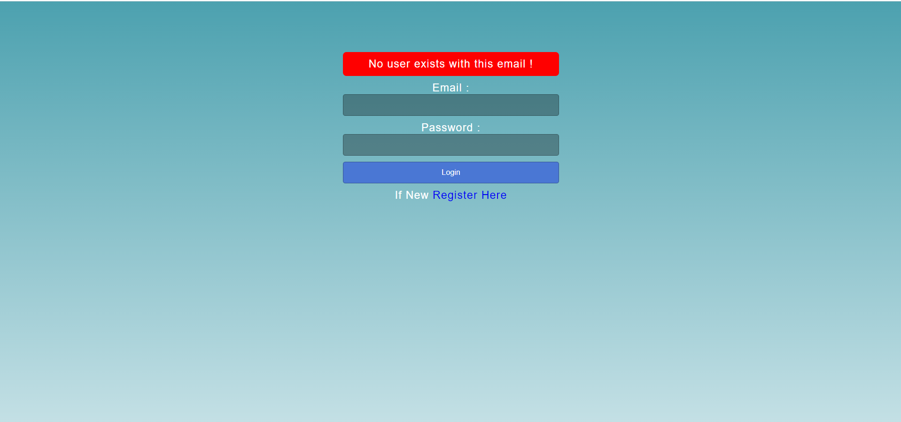
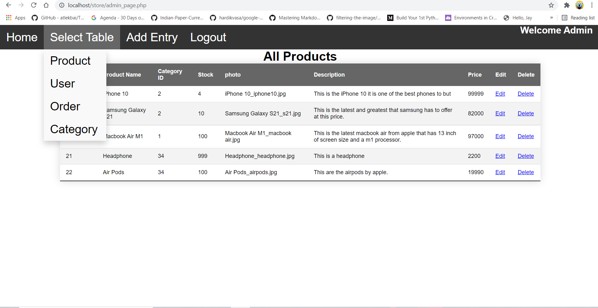

# ECommerce Cart Application
•	A PHP application where the user can login & add a product into cart and checkout. Admin can insert or remove products increase quantity to it or delete product from admin dashboard.
## Login Page

## Home Page for User

## Category Dropdown

## Home Page for Admin

## Admin Dashboard

## Add Product Page

